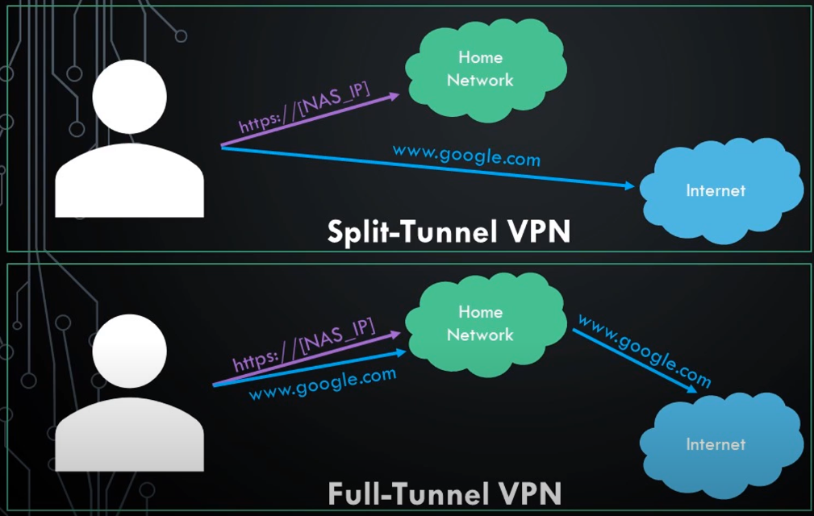

# raspberry-pi-nas


### 🧭 Project Goals

- 💾 **Centralized file storage and backup**  
  Provide a reliable way to store and back up personal files on a Raspberry Pi-powered NAS
- 🕒 **Scheduled** backups  
  Automatically back up data (e.g. from a laptop or phone) to the NAS on a regular schedule
- 🌍 **Remote access from anywhere**  
  Enable secure access to stored data globally via a VPN connection
- 📱 **Cross-device compatibility**  
  Ensure access to files from various devices (PCs, smartphones, tablets) regardless of the operating system
- 🗂️ **Web-based file interface**  
  Set up a browser-accessible interface (e.g. Nextcloud or File Browser) for convenient file management
- 💻 **Execute programs remotely**  
  Allow execution of program files (e.g. Python scripts -> toolbox) directly on the Raspberry Pi without needing to download them
- 🎮 **Game storage and remote access**  
  Explore the feasibility of storing games on the NAS and running them remotely, possibly via streaming or network mounts
- 🔐 **User-specific access control**  
  Implement user account management with customizable access rights and folder-level permissions


---

## Introduction

#### What is a NAS?

= Network-Attached Storage
- small computer connected to network that stores and shares files
- own private storage that's always availabe


---

## 🔧 Hardware

- Raspberry Pi 4 (4GB RAM)
- Power Supply
- [Cooling Case](https://www.amazon.de/Miuzei-Raspberry-K%C3%BChlk%C3%B6rper-AUS-Schalter-kompatibel/dp/B08FHN6HX8/ref=sr_1_6?__mk_de_DE=%C3%85M%C3%85%C5%BD%C3%95%C3%91&crid=5FPFBSAKBP9Z&dib=eyJ2IjoiMSJ9.rWEIGvFsseclRI2s8bgV39bF7XG7All8_g-AhRiQid9On6EFy_rC3N48WLd0AZfpFyoY1yVegiUlpzOjdMY02tNz_q04X9RcBukerVcsKd1X5Ksz04cGkgiOlWKvAJWBDdGMJrNKNHcTDyuuS8awbm4qIoeOop1SYBjb9YFnWyxWGprodjpeCNQjhK6w-UeHPfyRvkXwpvyVpLXbZnU8ykaIvxnAhbBK20tSAk2qo0A.rnqKbW4D1ynZZ0WTLVxQIZIBes_NIh7qFl9iISxBQw4&dib_tag=se&keywords=miuzei+case+for+raspberry+4&qid=1753211869&sprefix=miuzei+case+for+raspberry+4%2Caps%2C91&sr=8-6)  
- MicroSD card (32 GB)
- [External Storage (1 TB)](https://www.mediamarkt.de/de/product/_crucial-p3-plus-nvme-m2-2280ss-festplatte-1000-gb-ssd-m2-via-nvme-intern-2817721.html)
- [Case for SSD](https://www.mediamarkt.de/de/product/_isy-ise-1000-gy-nvme-ssd-gehause-grau-2876271.html)
- Ethernet Cable

---

## ⚙️ Software

| Component                 | Purpose                                                                                                                                  |
| ------------------------- | ---------------------------------------------------------------------------------------------------------------------------------------- |
| 🧠 Raspberry Pi OS (Lite) | operating system (OS) for the Raspberry Pi                                                                                               |
| 📂 Samba                  | enables network file sharing; lets you access, upload, and manage files stored on the Raspberry Pi                                       |
| 🛡️ PiVPN                 | create a secure VPN tunnel; lets you access your Raspberry Pi and NAS from anywhere on the internet as if you were at home               |
| 🌐 File Browser           | web-based interface; lets yo access, manage, upload, and download files from your Raspberry Pi using just a browser; includes user login |

---

## 🐾 Steps to Set-Up NAS

1. Download [Raspberry Pi Imager](https://www.raspberrypi.com/software/)
2. Backup and format MicroSD
3. Start Raspberry Pi Images once it has been installed - choose your device, Raspberry Pi OS Lite (64-Bit) and your MicroSD card
4. Change settings: set up username and password, enable SSH, (optional) choose time zone
5. Remove MicroSD card once it's ready and insert into Raspberry Pi
6. Connect Raspberry Pi to network and power it up
7. Connect wireless using SSH (will need username and password, IP address of Pi (find out by connecting to router))
	- use [PuTTY](https://www.chiark.greenend.org.uk/~sgtatham/putty/latest.html) - lets you remotely access the command line of another device (like here the Rasperry Pi) from WIndows PC
	- Linux/macOS have built-in SSH clients in the terminal; Windows doesn't, PuTTY fills that gap
8. Set a static IP address for your Pi
9. Update and upgrade everything once you are connected via SSH to your Raspberry Pi (simply good practice)
   ```
	sudo apt update
	sudo apt upgrade
	```
10. Find your storage that is connected to your Pi (sda, not mounted yet)
    ```
	lsblk
	```
11. Partition storage
    ```
	sudo fdisk /dev/sda
	m # Command (m for help)
	d # Delete a partition
	w # Write table to disk and exit

	# Create new fresh partition
	sudo fdisk /dev/sda
	n # Add a new partition
	w # Write table to disk and exit
	```
12. Format storage/ the newly created partition
    ```
	sudo mkfs.ext4 /dev/sda1
	```
13. Mount drive to system (so that we can access it)
    ```
	# Create mount point = new directory inside the system
	cd ..
	cd ..
	ls # show directories etc. (correct if you can see home, mnt, tmp, ...)
	cd /mnt/
	sudo mkdir mystorage
	ls
	cd ..

	# Mount drive to system
	sudo mount /dev/sda1 /mnt/mystorage
	
	```
14. Automate mount process (= mount drive to system everytime it is started; otherwise you would have to repeat it)
    ```
	sudo nano /etc/fstab
	```
	- add following to the end of the file before the comments:
	  */dev/sda1 /mnt/mystorage ext4 defaults,noatime 0 1*
	- Strg + X -> Y -> Enter
15. Reboot the system to check whether the drive is mounted automatically
    ```
	sudo reboot
	lsblk
	```
16. Create shared folder
    ```
	cd ..
	cd ..
	cd mnt/mystorage
	sudo mkdir shared
	ls
	```
17. Grant read and write permissions to all users on the system
    ```
	sudo chmod -R 777 /mnt/mystorage/shared
	```
18. Install Samba (so that the newly created shared folder can be shared)
    ```
	sudo apt install samba samba-common-bin
	```
19. Modify the config file of Samba to tell it to shared our folder over the network
    ```
	sudo nano /etc/samba/smb.conf
	```
	- add to the end of the file
	  *\[shared\]*
	  *path=/mnt/mystorage/shared*
	  *writeable=Yes*
	  *create mask=0777*
	  *directory mask=0777*
	  *public=no*
	- Strg + X -> Y -> Enter
20. Restart Samba to load the new configuration
    ```
	sudo systemctl restart smbd
	```
21. Grant drive access to user
	- \<username> is your username on the Pi
	- entering new password will add you as user to Samba
    ```
	sudo smbpasswd -a <username>
	```


---


## 🏃‍♀️ Steps to Set-Up VPN

1. Connect to Raspberry Pi over local network using SSH and PuTTY
2. Install PiVPN
   ```
	curl -L https://install.pivpn.io | bash
	```
	- set up static IP address?
		- depends whether you set the IP address of your Pi on your router to static
		- set to static... answer "\<Yes>", otherwise "\<No>"
	- choose OpenVPN (space to select) and proceed
	- port "1194" is the OpenVPN port (choose any other free port number for increased security)
	- choose "Google" as DNS provider
	- choose "DNS Entry" (follow before doing so: [Raspberry Pi DDNS Setup Tutorial! (DuckDNS)](https://www.youtube.com/watch?v=s-66gmIHoyE) / written instructions: [How to Setup DuckDNS on a Raspberry Pi](https://www.wundertech.net/how-to-setup-duckdns-on-a-raspberry-pi/))
	- public DNS name : "\<subdomain>.duckdns.org"
3. Create a profile
   ```
	pivpn add
	```
4. See all the profiles that you created
   ```
	cd ovpns
	ls
	```
5. Get this profile off your Pi to the device which you want to connect via VPN to your local network
	- NAS is already set-up: copy ovpn profile to shared folder
	  ```
		sudo cp <profile-name>.ovpn /mnt/mystorage/shared
		```
	- if not: follow instructions in video 06:13: [OpenVPN Raspberry Pi Setup using PiVPN! (Easy Tutorail)](https://www.youtube.com/watch?v=kLmbgJe1rEU)
6. Port forward UDP port on router to Raspberry Pi (setup depends on router)
7. Decide between Split-Tunnel VPN and Full-Tunnel VPN
	- split-tunnel connection is enough since the purpose is to access our shared Samba folder from outside our network
	- full-tunnel VPN connection should be used when trying to secure your connection at public Wi-Fi locations
	- a OpenVPN profile is by default configured as a full-tunnel VPN connection
	- to make an OpenVPN profile act as split-tunnel VPN add the following two lines to the profile file (where the IP address must correpond to network IP address range)
	  *route-nopull*
	  *route 192.168.2.0 255.255.255.0 vpn_gateway*

8. Download OpenVPN client software (different for each device)
	- Windows: [OpenVPN Connect for Windows](https://openvpn.net/client/)  
	- iOS: OpenVPN Connect
	- Android: OpenVPN für Android

---


## 🔗 Connect to NAS

#### From Inside Your Network

1. Create test file "helloworld.txt"
   ```
	cd /mnt/mystorage/shared
	touch helloworld.txt
	ls
	sudo nano helloworld.txt # to add some content
	```
2. Windows: go to "This PC" and enter "\\\\\<ip>\shared" -> enter your login credential to **Samba**
3. Now that we know that everything is working, we can add our Raspberry Pi to our network locations
	- right click under "This PC" -> add network address -> \\\\\<ip>\shared

#### From Outside Your Network

= network connection that is external to your local area network (LAN)
- outside network = network that is external to the immediate network environment in which a device is located
- secure and reliable option: VPN (Virtual Private Network)
	- establishes a secure and encrypted connection your device and a remote network over the internet 
	- allows access to Pi as if you were on the same local network
	- dynamic DNS (Domain Name System) can be utilized to assign a domain name to Pi's IP address (makes it easier to connect remotely)
	- consider enabling two-factor authentication to ensure security of remote access
- ...
- see "Steps to Set-Up VPN" for enabling VPN to connect from outside your local area network

---

## 📄 References

NAS:  
[DIY NAS (Network-Attached Storage) with Raspberry Pi 5](https://www.hackster.io/ElecrowOfficial/diy-nas-network-attached-storage-with-raspberry-pi-5-e91a37)  
[How to Build Your First NAS! Samba Share Setup Explained](https://www.youtube.com/watch?v=iDruhrG4hSk)  

VPN:  
[OpenVPN Raspberry Pi Setup using PiVPN! (Easy Tutorial)](https://www.youtube.com/watch?v=kLmbgJe1rEU)  
[VPN Server auf dem Raspberry Pi installieren - PiVPN der OpenVPN Client für den Pi](https://www.youtube.com/watch?v=A17sYeDcnws)  


[How To Connect To Raspberry Pi From Outside Network](https://www.howto-do.it/how-to-connect-to-raspberry-pi-from-outside-network/#Connecting_to_Raspberry_Pi_using_a_VPN)  
links to tutorial for VPN
[Is there an actual safe way to access my NAS from outside of my home Wi-Fi?](https://www.reddit.com/r/synology/comments/otczia/is_there_an_actual_safe_way_to_access_my_nas_from/)  

For upgrading Hardware Set-up: [Build Your Own Homelab NAS with a Raspberry Pi](https://kitemetric.com/blogs/build-your-own-homelab-nas-with-a-raspberry-pi)
- but will that allow the cooling system to still work?
- have a look
For connecting to NAS using iPhone: [How to build a Raspberry Pi NAS](https://www.raspberrypi.com/tutorials/nas-box-raspberry-pi-tutorial/)  
For adding more than one user: [Simple NAS server (with external access) with Raspberry Pi](https://hobby-project.com/arduino-raspberry-pi/simple-nas-server-with-external-access-with-raspberry-pi/)